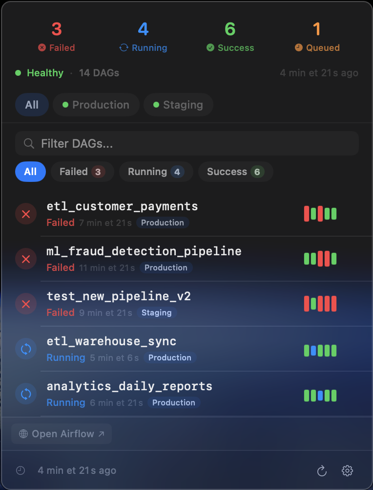

<p align="center">
  
</p>

<h1 align="center">AirflowBar</h1>

<p align="center">
  A native macOS menu bar app for monitoring Apache Airflow DAGs.
</p>

<p align="center">
  <a href="https://github.com/maroil/airflow-bar/actions/workflows/ci.yml"></a>
  <a href="https://github.com/maroil/airflow-bar/releases/latest"></a>
  <a href="LICENSE"></a>
  
  
</p>

---

## Features

- **Menu bar status icon** with dynamic badge showing failed/running DAG counts
- **Real-time DAG monitoring** via Airflow REST API (v1 and v2 auto-detection)
- **Multi-environment support** — monitor multiple Airflow instances, enable/disable each independently
- **Authentication** — Basic Auth and Bearer Token
- **Configurable polling** — intervals from 10 seconds to 30 minutes with exponential backoff
- **Search & filter** — by DAG ID, tag, owner, or state; regex-based DAG filtering
- **Show/hide paused DAGs** for a cleaner view
- **macOS notifications** for DAG failures and recoveries
- **Health monitoring** — track Airflow instance availability at a glance
- **Automatic update checks** — notifies you when a new version is available
- **Zero dependencies** — pure Swift using Foundation, CryptoKit, AppKit, and SwiftUI

## Installation

### Homebrew

```bash
brew tap maroil/airflow-bar
brew install --cask airflow-bar
```

### Download

Download the latest DMG from the [Releases page](https://github.com/maroil/airflow-bar/releases/latest).

> **Note:** The app is currently unsigned and not notarized. On first launch, right-click the app and select **Open** to bypass Gatekeeper.

### Build from Source

Requires macOS 14+ and Swift 6.0+.

```bash
git clone https://github.com/maroil/airflow-bar.git
cd airflow-bar/macos
make release
make app
```

The `.app` bundle will be at `AirflowBar.app`. To create a DMG installer:

```bash
make dmg VERSION=0.1.0
```

## Usage

AirflowBar lives in your menu bar. On first launch, the settings window opens automatically.

### Configuration

| Setting | Description |
|---------|-------------|
| **URL** | Base URL of your Airflow webserver (e.g. `http://localhost:8080`) |
| **Auth** | Basic Auth (username/password) or Bearer Token |
| **Refresh interval** | Polling frequency: 10s, 30s, 1m, 2m, 5m, 15m, or 30m |
| **DAG filter** | Regex pattern to include/exclude specific DAGs |
| **Show paused** | Toggle visibility of paused DAGs |
| **Notifications** | Alerts for DAG failures and recoveries |
| **Update checks** | Automatic daily check for new releases |

### Security

Configuration is stored at `~/.airflowbar/config.json`. Credentials are encrypted with AES-GCM (via CryptoKit) and stored separately at `~/.airflowbar/credentials.enc`. The encryption key is kept in `~/.airflowbar/.credentials.key` with `600` file permissions.

## Development

### Git Hooks

Install the repo-managed Git hooks once after cloning:

```bash
./scripts/install-git-hooks.sh
```

The hooks enforce conventional commit prefixes such as `feat:`, `fix:`, and `chore:`. They also run the same checks gated by CI before each commit:

- `cd macos && swift build`
- `cd macos && swift test`
- `cd website && npm run build`

### Prerequisites

- macOS 14+ (Sonoma)
- Swift 6.0+ / Xcode 16+

### Build & Test

```bash
cd macos
make build    # swift build
make test     # swift test
make run      # swift run AirflowBar
```

For website changes, install dependencies once and build locally with:

```bash
cd website
npm ci
npm run build
```

Run a single test suite:

```bash
cd macos
swift test --filter KeychainServiceTests
```

### Local Airflow

A Docker Compose file is included for local development:

```bash
cd macos
make airflow-up     # starts Airflow at http://localhost:8080 (airflow/airflow)
make airflow-down   # stops the stack
```

### Screenshot Mode

Generate screenshots for documentation without a live Airflow instance:

```bash
cd macos
make screenshot
```

### Project Structure

```
macos/
├── Sources/
│   ├── AirflowBar/             # macOS app (SwiftUI + AppKit)
│   │   ├── Views/              # PopoverContent, SettingsView, FilterBar
│   │   ├── Resources/          # App icon
│   │   ├── ScreenshotMode.swift
│   │   └── UpdateCheckViewModel.swift
│   └── AirflowBarCore/         # Core library (no UI imports)
│       ├── Config/             # AppConfig, ConfigStore, KeychainService
│       ├── Models/             # DAGRun, HealthInfo, SemanticVersion, AppRelease
│       └── Networking/         # AirflowAPIClient, UpdateChecker
├── Tests/
│   └── AirflowBarCoreTests/    # Swift Testing (@Suite, @Test)
├── dmg-resources/              # DMG installer background
└── docker-compose.yaml         # Local Airflow stack

website/                        # Astro landing page
.github/workflows/              # CI and Release automation
```

### Architecture

The project uses a two-target Swift Package Manager structure:

- **AirflowBarCore** — Pure Swift library with no UI imports. Contains models, networking, and configuration logic. All testable code lives here.
- **AirflowBar** — SwiftUI views and AppKit integration. Depends on AirflowBarCore.

Key architectural decisions:
- Actors for thread safety (`AirflowAPIClient`)
- `async`/`await` throughout — no completion handlers
- `TaskGroup` for concurrent multi-environment fetching
- `@MainActor` for all UI state
- File-based AES-GCM encryption instead of macOS Keychain (avoids permission prompts in unsigned builds)

## License

[MIT](LICENSE)
